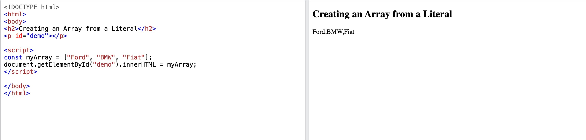
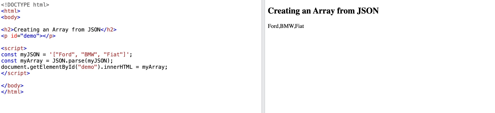

### Arrays

#### This is a JSON string:
```
'["Ford", "BMW", "Fiat"]'
```
Inside the JSON string there is a JSON array literal:
```
["Ford", "BMW", "Fiat"]
```
Arrays in JSON are almost the same as arrays in JavaScript.

In JSON, array values must be of type string, number, object, array, boolean or null.

In JavaScript, array values can be all of the above, plus any other valid JavaScript expression, including functions, dates, and undefined.

### JavaScript Arrays

#### You can create a JavaScript array from a literal:

```
myArray = ["Ford", "BMW", "Fiat"];
```
```
<!DOCTYPE html>
<html>
<body>
<h2>Creating an Array from a Literal</h2>
<p id="demo"></p>

<script>
const myArray = ["Ford", "BMW", "Fiat"];
document.getElementById("demo").innerHTML = myArray;
</script>

</body>
</html>
```

#### You can create a JavaScript array by parsing a JSON string:

```
myJSON = '["Ford", "BMW", "Fiat"]';
myArray = JSON.parse(myJSON);
```

Accessing Array Values
You access array values by index:

```
myArray[0];
```

```
<!DOCTYPE html>
<html>
<body>

<h1>Access an Array by Index</h1>
<p id="demo"></p>

<script>
const myJSON = '["Ford", "BMW", "Fiat"]';
const myArray = JSON.parse(myJSON);
document.getElementById("demo").innerHTML = myArray[0];
</script>

</body>
</html>
```


 You access array values by index:

```
myObj.cars[0];
```
```
<!DOCTYPE html>
<html>
<body>

<h2>Access Array Values</h2>
<p id="demo"></p>

<script>
const myJSON = '{"name":"John", "age":30, "cars":["Ford", "BMW", "Fiat"]}';
const myObj = JSON.parse(myJSON);

document.getElementById("demo").innerHTML = myObj.cars[0];
</script>

</body>
</html>
```

### Looping Through an Array
You can access array values by using a for in loop:
```
for (let i in myObj.cars) {
  x += myObj.cars[i];
}
```

```
<!DOCTYPE html>
<html>
<body>

<h2>Looping an Array</h2>
<p id="demo"></p>

<script>
const myJSON = '{"name":"John", "age":30, "cars":["Ford", "BMW", "Fiat"]}';
const myObj = JSON.parse(myJSON);

let text = "";
for (let i in myObj.cars) {
  text += myObj.cars[i] + ", ";
}

document.getElementById("demo").innerHTML = text;
</script>

</body>
</html>
```

#### Or you can use a for loop:
```
for (let i = 0; i < myObj.cars.length; i++) {
  x += myObj.cars[i];
}
```
```
<!DOCTYPE html>
<html>
<body>

<h2>Looping an Array</h2>
<p id="demo"></p>

<script>
const myJSON = '{"name":"John", "age":30, "cars":["Ford", "BMW", "Fiat"]}';
const myObj = JSON.parse(myJSON);

let text = "";
for (let i = 0; i < myObj.cars.length; i++) {
  text += myObj.cars[i] + ", ";
}

document.getElementById("demo").innerHTML = text;
</script>

</body>
</html>
```


